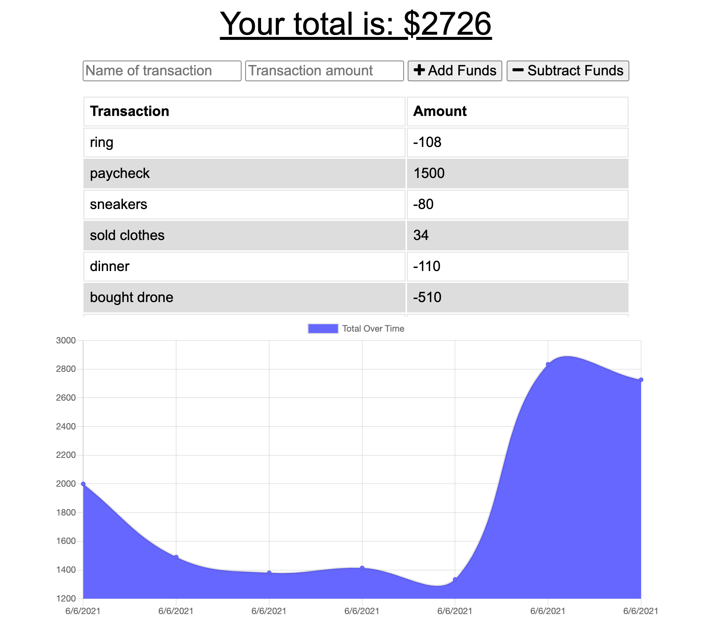
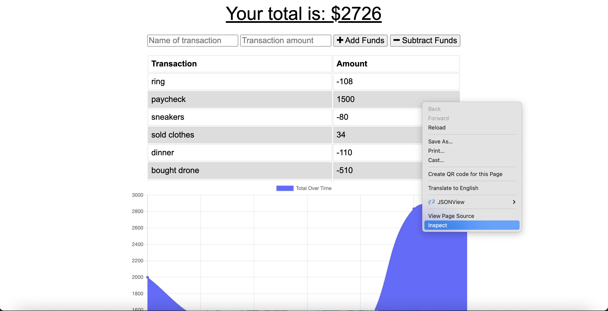
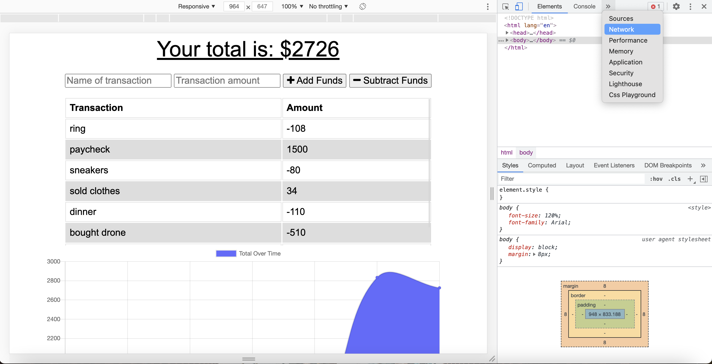
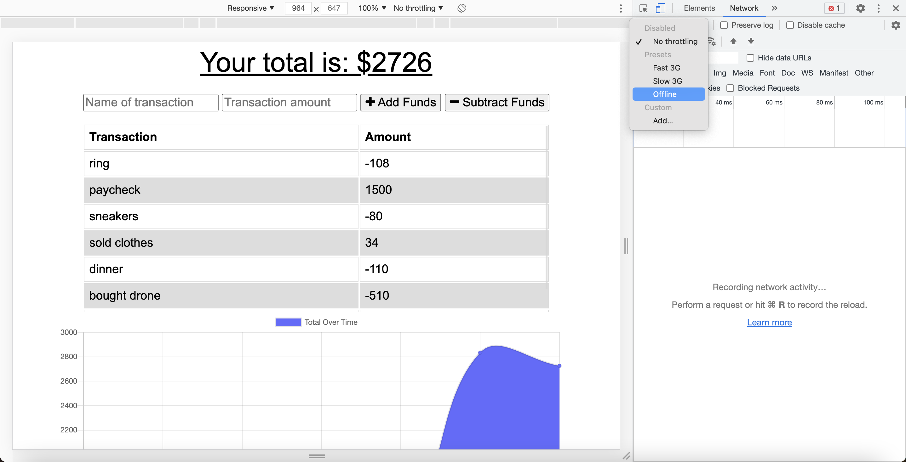
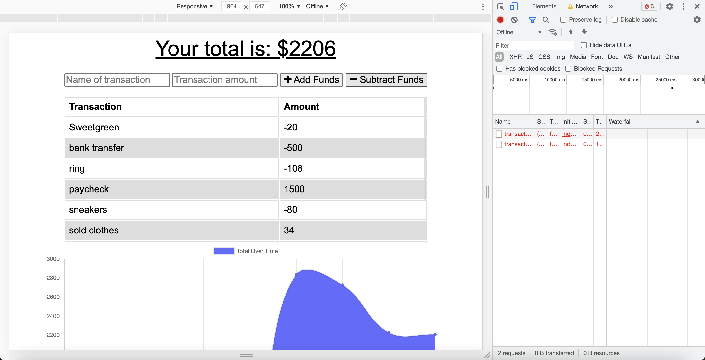
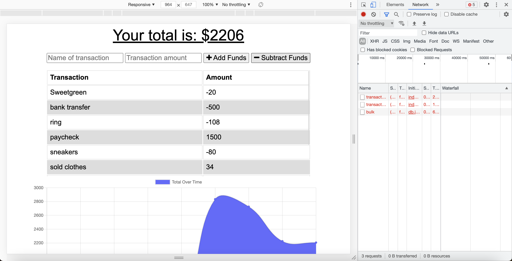

# Offline Budget Tracker

## What is the project?

This project demonstrates the use of JavaScript in conjunction with indexedDB and MongoDB. With this Budget Tracker, a user can log different types of income and expenses even in the case of loss of internet.

## Link to Deployed Project  

https://shielded-badlands-97336.herokuapp.com/

## Why did I decide to do this project?

I love tracking my finances and knowing where I am with my monthly budget and saving goals. I am also a very visual person and like seeing a visual representation of my incoming and outgoing money. I also love the idea and the app continuing to work in the event of the internet disconnecting.

## What I learned in the process?

I learned a lot more about MongoDB and learned some additional features that the browser has such as indexedDB.

## What makes this project stand out?

This application is really useful for someone who is loves to keep a budget and wants to stay on top of their finances. It is perfect for people traveling who might not always have access to the internet to be able to log their expenses. With this app, such a person could log all their incomes and expenses and then once they got to a place with interner, the logs would be transfered to the database.

## Project Screenshot  

 

## Testing

To test the offline functionality of this app:

1. Right-click on the application and click on "Inspector" to open the web dev tools.

2. Click on the "Netwok" tab.

3. Click on the throttling drop-down menu.

4. Select "Offline"

Now, when you start adding transaction, the app will continue working as normal but you will see in the Network Activity window logs for failed transactions.

Image: Logs of failed transactions.

Connect back to the internet and notice a log that says "bulk" which indicates that all the failed entries were transfered to the database.

Image: "bulk" log showing successful transfer.

## Credits

Thank you to Columbia's Full-Stack Web Developer bootcamp for all the assistance and for teaching me all that I have learned. Credit also goes to Google for helping me find any needed resource.

## Licence

Copyright (c) 2021 Steven Stefanov

Permission is hereby granted, free of charge, to any person obtaining a copy
of this software and associated documentation files (the "Software"), to deal
in the Software without restriction, including without limitation the rights
to use, copy, modify, merge, publish, distribute, sublicense, and/or sell
copies of the Software, and to permit persons to whom the Software is
furnished to do so, subject to the following conditions:

The above copyright notice and this permission notice shall be included in all
copies or substantial portions of the Software.

THE SOFTWARE IS PROVIDED "AS IS", WITHOUT WARRANTY OF ANY KIND, EXPRESS OR
IMPLIED, INCLUDING BUT NOT LIMITED TO THE WARRANTIES OF MERCHANTABILITY,
FITNESS FOR A PARTICULAR PURPOSE AND NONINFRINGEMENT. IN NO EVENT SHALL THE
AUTHORS OR COPYRIGHT HOLDERS BE LIABLE FOR ANY CLAIM, DAMAGES OR OTHER
LIABILITY, WHETHER IN AN ACTION OF CONTRACT, TORT OR OTHERWISE, ARISING FROM,
OUT OF OR IN CONNECTION WITH THE SOFTWARE OR THE USE OR OTHER DEALINGS IN THE
SOFTWARE.